##会場の既存変更
■フロー（流れ）

1. 会場リスト一覧に会場IDを追加する
2. ロゴ、メインヴィジュアルを作成する（素材がある場合のみ）
3. ロゴ、メインヴィジュアルをWordPressに登録する（素材がある場合のみ）
4. 会場を登録する
5. 会場に動画を登録する

###1.会場リスト一覧に会場IDの追加

1. [会場リスト](https://docs.google.com/spreadsheets/d/1JU8FPo8PMtK10ZBqgtvSBIifV1bXYYf4q0z2XQlbsoI/edit#gid=188206478)を開き、下部のシートから登録する会場の地域を選ぶ
2. カテゴリーごとにそれぞれ情報を入力する

  例).

  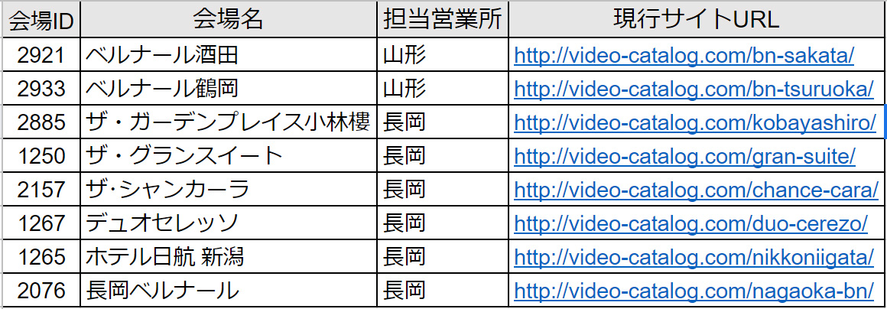

  会場詳細の情報は依頼シート等で確認する

###2.会場ロゴ、メインヴィジュアルの作成（素材がある場合のみ）

1. 会場ロゴとメインビジュアル用の画像が用意されている場合は画像の加工を行う

  ・ロゴは原則AIデータでもらうことを前提にしているので、AIでpng、jpg等の画像に書き出す

2. 会場ロゴは画像名を「会場ID_logo」と名前を付けて保存する

  例)．

  「2158_logo.png」

3. メインヴィジュアルは幅1400px高さ788pxで加工し、「会場ID_main」と名前を付けて保存する

  例)．
  「2158_main.jpg」

###3.ロゴ、メインヴィジュアルをWordPressに登録する（素材がある場合のみ）

1. WordPressの管理画面からMedia Library Foldersの項目を選ぶ

  

2. logoのフォルダを開く

  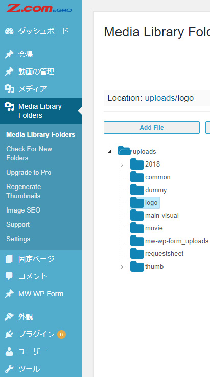

3. 「Add File」をクリックし、「Drag & Drop Files Here」に該当のロゴ画像をドラッグ＆ドロップする

  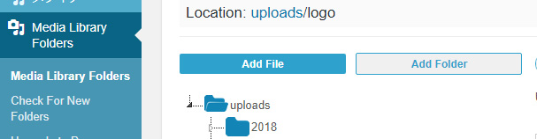

  

4. main-visualのフォルダを開く

  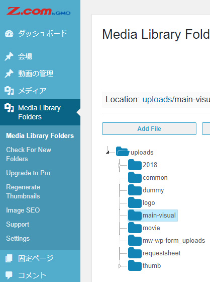

5. 「Add File」をクリックし、「Drag & Drop Files Here」に該当の会場画像をドラッグ＆ドロップする

  

  

###4.WordPressに会場を登録する

1. WordPressの管理画面から「会場」をクリックする

  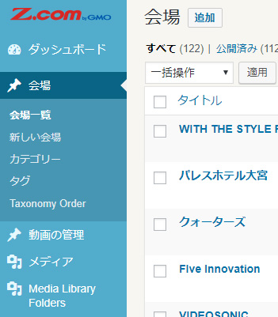

2. 上の「追加」ボタンをクリックする
3. 会場名を入力する

  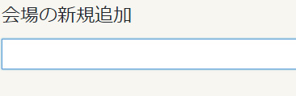

4. 「会場の情報入力」項目に移り「会場ID」を入力する

  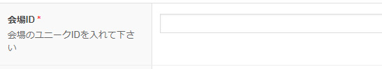

5. 「営業所」から登録する営業所を選択する

  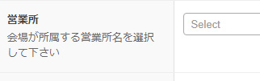

6. 会場画像がある場合、右のバーにある「アイキャッチ画像を設定」から登録した会場の画像を選択する

  

7. 「メインビジュアル設定」に移り該当会場のロゴがある場合は「ロゴ」に画像を設定する

  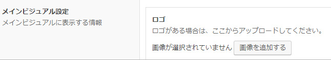

8. 該当会場のロゴが無い場合は「タイトル名」に会場の名前を入力し、タイトルの色を選択する

  

  ・タイトルの色は基本的に白で良いが、メインヴィジュアルがありタイトルが目立たない場合は黒を選択する

9. 「背景色」はメインビジュアルの背景画像がない場合に設定する

  

  詳細）

  * ロゴがある場合はロゴが目立つ色を設定する
  * ロゴが無い場合は、黒でよい

10. 会場画像を設定した場合は「背景画像の位置」と「背景画像のフィルター」を選択し、それぞれ選択する

  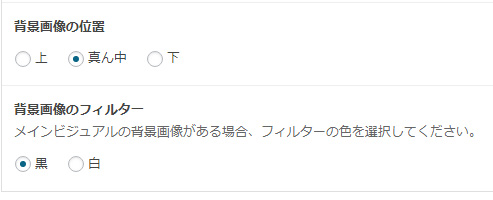

  * 「背景画像の位置」はデフォルトの位置（中央）では背景画像のメイン（例えば新郎新婦）部分が見切れてしまう場合は、下、または上の位置に変更する。
  * 「背景画像のフィルター」は背景画像にロゴを載せた時に、ロゴが見えにくい場合は設定する
  * 黒など暗い色の場合は背景はグレーを設定する。

###5.WordPressで会場に動画を登録する

1. 依頼シートの内容を確認する
2. 「■フロー4.」までの設定が完了したら、「商品情報入力」の「ブロック追加」をクリックする

  

3. 「カテゴリー名」から掲載したい動画のカテゴリーを選択する

  

4. サブタイトルには指定のタイトルを入れる（分からない場合は聞いて確認してください）

  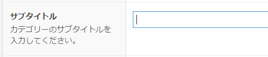

5. 「商品」の欄に掲載したい動画のタイトル、または動画ID（※動画IDについては下記の動画の更新項目を参考にしてください）を入力する

  

6. 表示された動画のサムネイル、タイトル、動画IDから該当の動画を選択し、クリックすると右の動画一覧に追加される
7. 動画一覧に追加した動画は、上から順番に会場ページに表示される。順番を入れ替えたい場合はドラッグで入れ替えることができる。また削除したいときは動画をホバーし、マイナスのマークをクリックすると削除される

  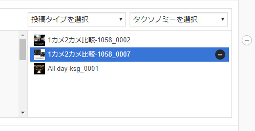

8. カテゴリーを追加する場合は、左下のブロックの追加をクリックする。新しくカテゴリーブロックが出てくるので必要な数のカテゴリーと動画を追加する

  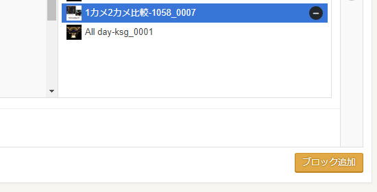

9. すべてのカテゴリーと動画の追加が終了したら、右上の「下書き保存」する

  

  ・下書き保存→ディレクター確認→担当営業確認→公開という流れ
